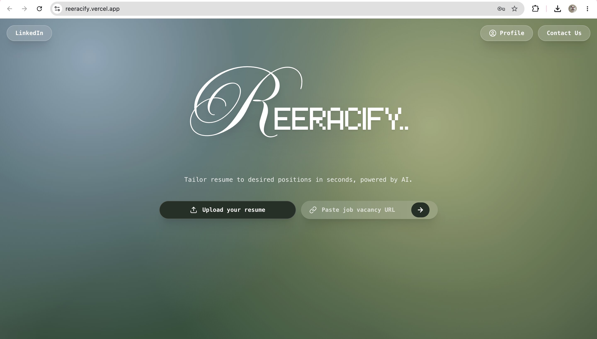
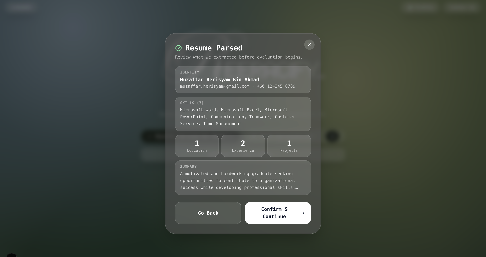
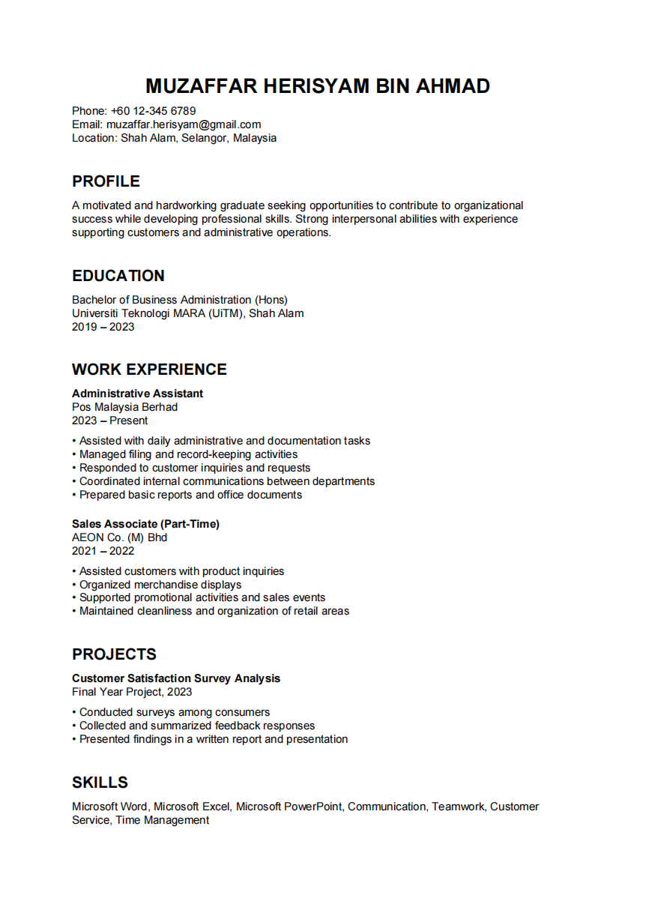
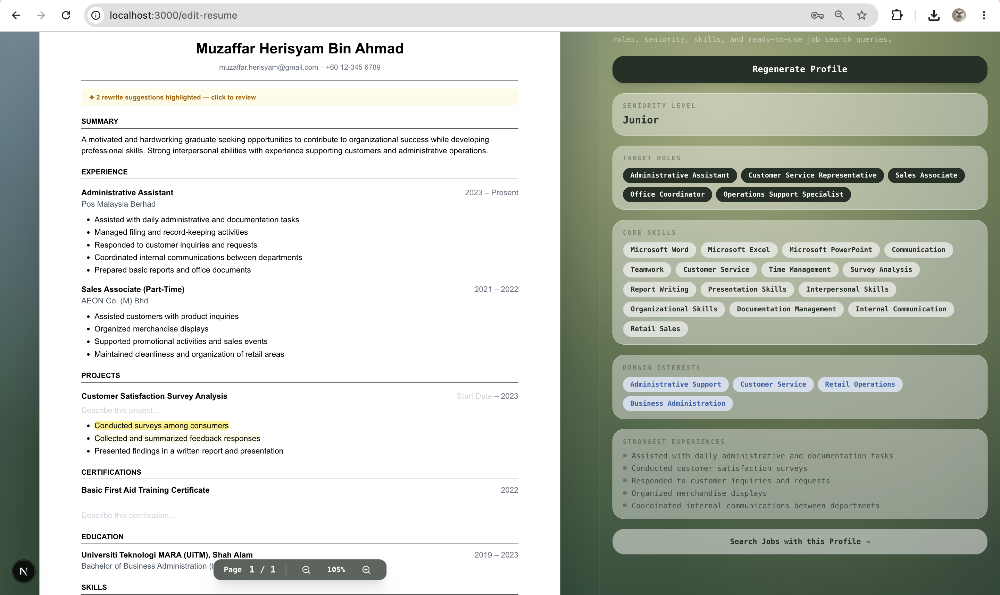

# Reeracify

AI-Powered Career Preparation Platform

Reeracify helps job seekers improve resumes, evaluate ATS compatibility, generate tailored cover letters, and discover relevant jobs — all in one platform.

**Live app:** [reeracify.vercel.app](https://reeracify.vercel.app)  
**API:** [reeracify-backend.onrender.com](https://reeracify-backend.onrender.com)  
**API Docs:** [reeracify-backend.onrender.com/docs](https://reeracify-backend.onrender.com/docs)

---

## Website Preview

**Live Demo:** https://reeracify.vercel.app

---

## Table of Contents

1. Architecture Overview
2. Architecture Diagram
3. Problem Statement
4. Solution Approach
5. Multi-Agent Design
6. RAG Pipeline
7. Technology Stack
8. Sample Workflow
9. Screenshots
10. Key Features
11. Future Work
12. Team

---

# Architecture Overview

### Frontend
- Next.js
- React
- Tailwind CSS

### Backend
- FastAPI
- Python

### AI Technologies
- GPT-5
- LangGraph
- LangChain
- Retrieval-Augmented Generation (RAG)

### Database
- Supabase
- pgvector

### Deployment
- Vercel
- Render

---

# Architecture Diagram

---

# Problem Statement

Many job seekers are rejected during the resume screening stage before reaching interviews.

Current solutions have several limitations:

- Professional resume review services are expensive.
- Resume optimization can take several days.
- Users often need multiple platforms for resume writing, ATS checking, cover letter generation, and job searching.
- Existing tools rarely provide an end-to-end workflow.

As students applying for internships and jobs ourselves, we experienced these challenges firsthand.

---

# Solution Approach

Reeracify provides an end-to-end AI-powered workflow.

Users simply upload their resume and optionally provide a job posting URL.

The platform then:

1. Parses the resume
2. Analyzes job requirements
3. Evaluates ATS compatibility
4. Generates rewrite suggestions
5. Creates a tailored cover letter
6. Recommends suitable jobs

All within a single platform.

---

# Multi-Agent Design

Reeracify uses 8 specialized AI agents coordinated through LangGraph.

## Resume Parser Agent
Extracts resume information into structured JSON.

## Job Analyzer Agent
Identifies required skills, responsibilities, and keywords from job descriptions.

## RAG Retriever Agent
Retrieves the most relevant resume content using vector similarity search.

## ATS Evaluator Agent
Calculates ATS compatibility and identifies strengths and weaknesses.

## Company Research Agent
Collects company information to improve personalization.

## Rewrite Agent
Generates ATS-focused resume improvements.

## Cover Letter Agent
Creates personalized cover letters.

## Candidate Profile Agent
Builds a career profile and supports job recommendations.

---

# RAG Pipeline

Reeracify uses Retrieval-Augmented Generation (RAG) to improve evaluation quality.

### Resume Processing

Resume Upload

↓

Text Chunking

↓

Embedding Generation

↓

Vector Database Storage

### Evaluation Stage

Job Description

↓

Similarity Search

↓

Top Relevant Resume Chunks

↓

ATS Evaluation

Cover Letter Generation

Rewrite Suggestions

Using only relevant resume sections improves efficiency and reduces unnecessary context.

---

# Technology Stack

| Layer | Technology |
|---------|------------|
| Frontend | Next.js, React, Tailwind CSS |
| Backend | FastAPI, Python |
| AI Models | GPT-5 |
| Agent Framework | LangGraph, LangChain |
| Embeddings | text-embedding-3-small |
| Database | Supabase |
| Vector Search | pgvector |
| Deployment | Vercel, Render |

---

# Sample Workflow

User uploads Resume (PDF/DOCX)

↓

Resume Parser Agent

↓

Structured Resume JSON

↓

Job Analyzer Agent

↓

RAG Retriever Agent

↓

ATS Evaluation

↓

Rewrite Suggestions

↓

Cover Letter Generation

↓

Job Discovery

↓

Improved Resume Export

---

# Screenshots

## Resume Analysis

---

## ATS Evaluation

---

## Rewrite Suggestions

---

## Cover Letter Generation

---

## Job Discovery

---

# Key Features

### ATS Evaluation
- Resume-job compatibility analysis
- Keyword matching
- Strength and weakness identification

### AI Rewrite Suggestions
- ATS-focused improvements
- One-click approve/reject workflow
- Real-time updates

### Cover Letter Generation
- Personalized cover letters
- Based on resume and job requirements

### Job Discovery
- Career-profile-based recommendations
- Supports 11 countries
- Resume-job fit evaluation

### Direct Editing
- Edit resumes directly inside the platform
- No need for Word or Google Docs

---

# What Makes Reeracify Different?

### LangGraph Multi-Agent Workflow
8 specialized AI agents collaborate to automate career preparation.

### RAG-Based Retrieval
Only relevant resume content is used during evaluation.

### User-Controlled Experience
Users remain fully in control of edits and approvals.

### Global Support
Supports multilingual resumes and job discovery across 11 countries.

---

# Future Work

- Evaluate the system using more diverse resumes
- Improve ATS evaluation consistency and reliability
- Expand support for recruiter-side candidate screening
- Develop talent discovery and candidate recommendation features

---

# Team

### Powerpuff Girls

- Emira Syazwani
- Julia Irsalina
- Nur Musira

### Advisor
Prof. 이숙윤

### Department
College of Informatics, Korea University
