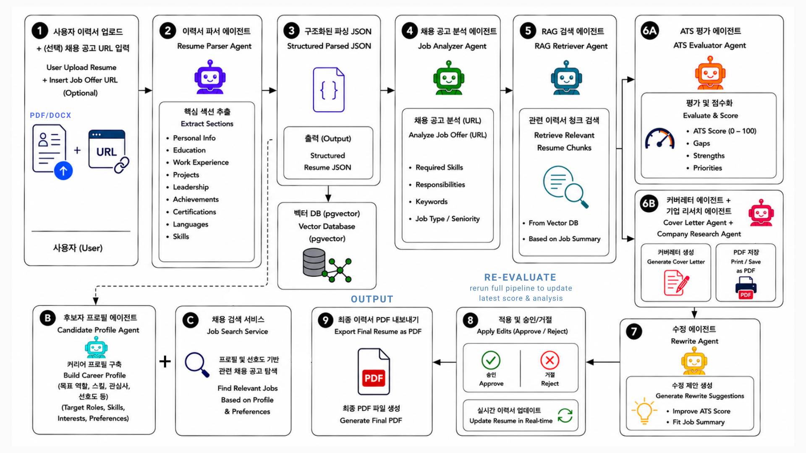
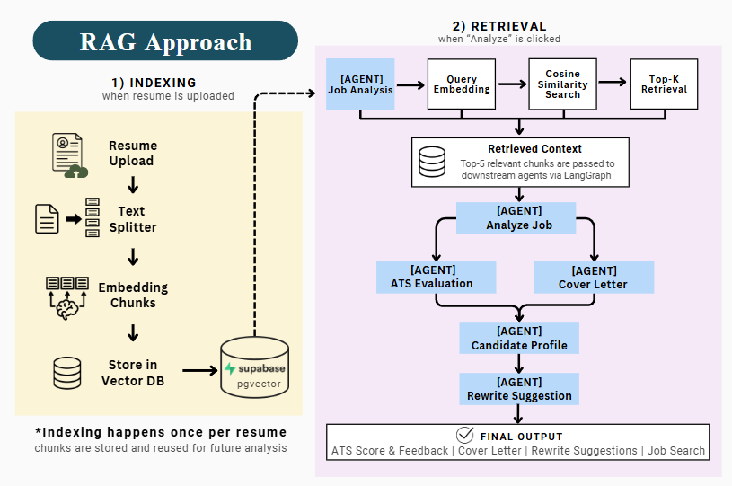
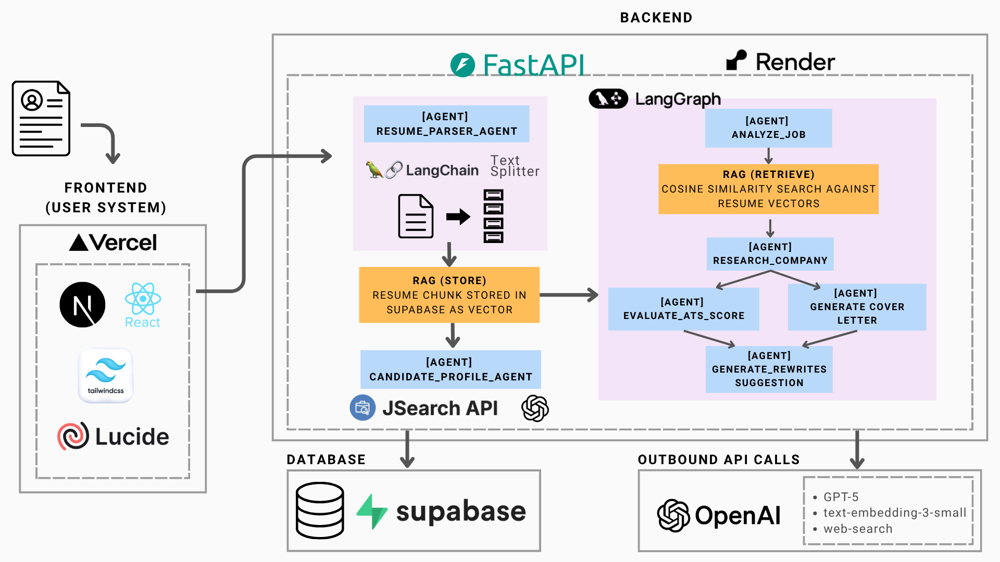
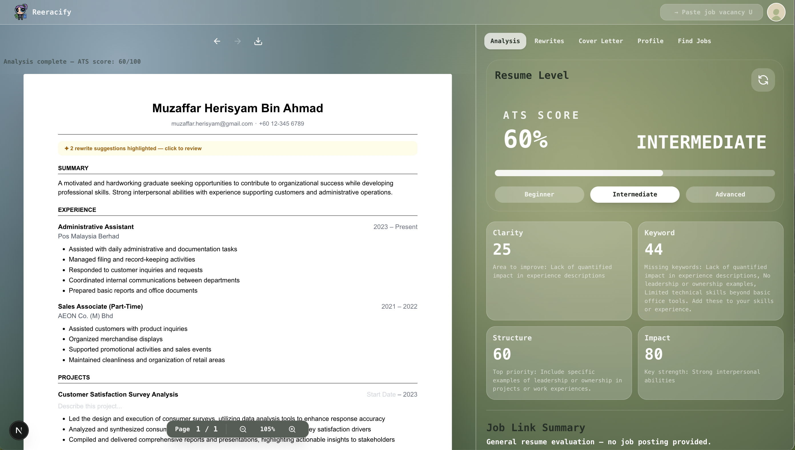
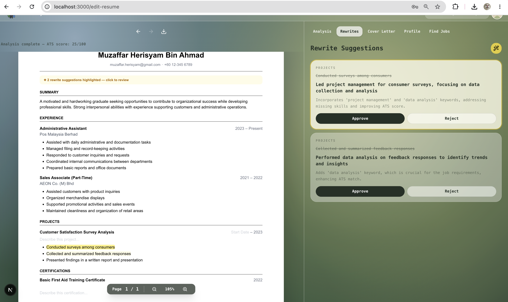
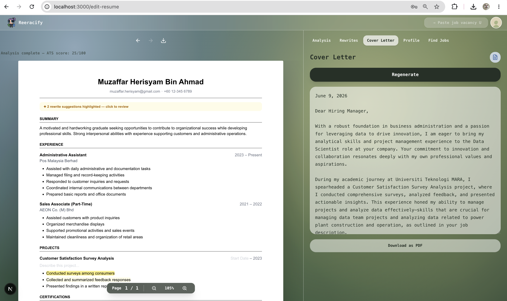
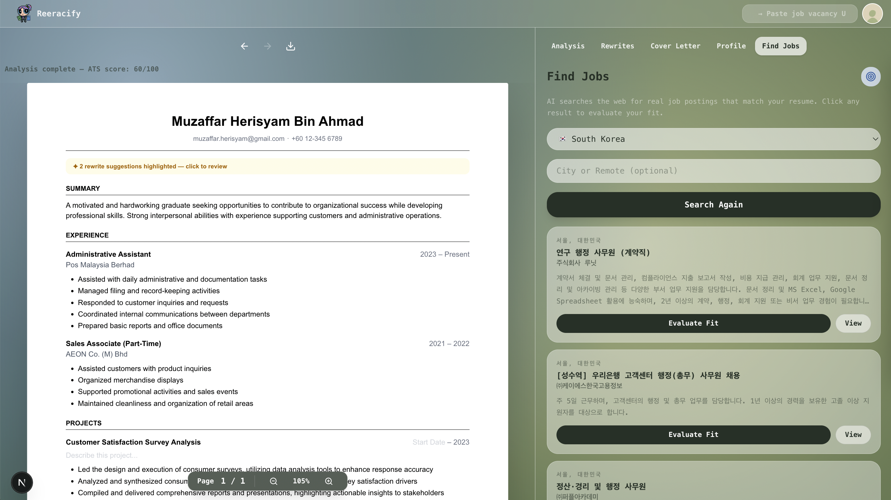
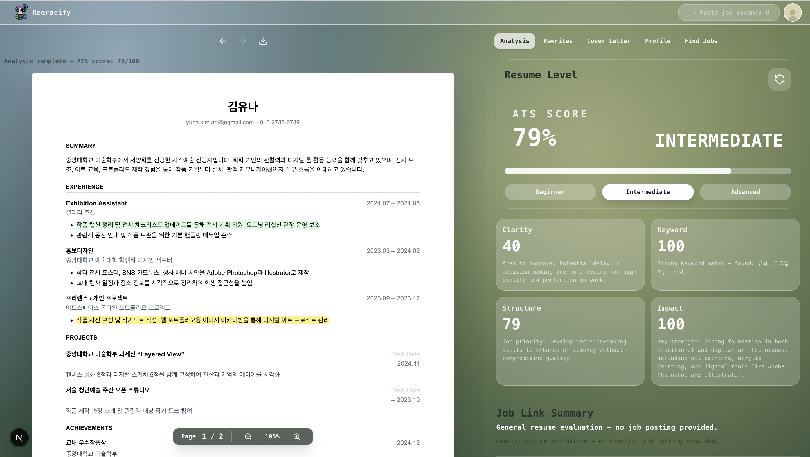
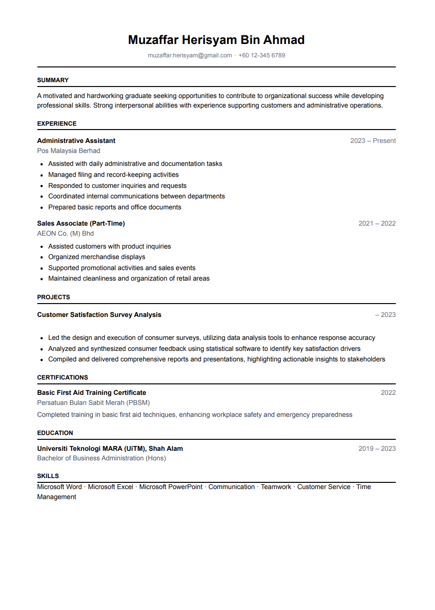
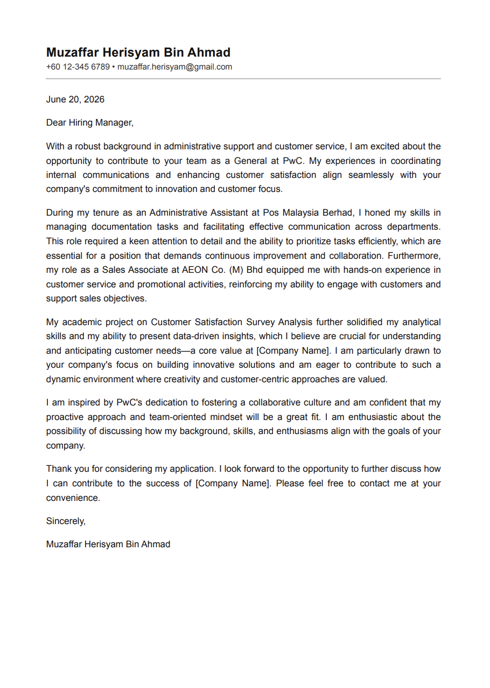

# Reeracify

AI-powered resume optimization platform that helps job seekers improve resumes, generate tailored cover letters, evaluate ATS compatibility, and discover relevant job opportunities — all in one place.

---

## Live Demo

🌐 https://reeracify.vercel.app
---

## Project Overview

Finding a job often requires using multiple tools:

- Writing resumes in Word or Google Docs
- Using AI tools to improve resume content
- Checking ATS scores on separate platforms
- Creating cover letters manually
- Searching job postings across multiple websites

Reeracify combines these tasks into a single platform.

Users can upload a resume, analyze ATS compatibility, receive rewrite suggestions, generate cover letters, and discover matching jobs through one workflow.

---

## Key Contributions

| Contribution | Description |
|-------------|-------------|
| Multi-Agent AI Workflow | 8 specialized AI agents coordinated using LangGraph |
| RAG-Based Evaluation | Retrieves only relevant resume content for focused analysis |
| Direct Editing | Edit resumes and cover letters directly within the platform |
| Global Job Discovery | Supports job search across 11 countries |
| Multilingual Support | Supports resumes and job descriptions in multiple languages |

---

## System Workflow

### Workflow Steps

1. Upload Resume (PDF/DOCX)
2. Parse Resume into Structured JSON
3. Analyze Job Description
4. Retrieve Relevant Resume Context using RAG
5. Evaluate ATS Compatibility
6. Generate Cover Letter
7. Generate Rewrite Suggestions
8. Edit Resume Directly
9. Export Final Resume

---

## RAG-Based Resume Retrieval

Instead of sending the entire resume to the AI model every time, Reeracify:

1. Splits resumes into chunks
2. Converts chunks into embeddings
3. Stores embeddings in pgvector
4. Retrieves only the most relevant chunks based on job requirements
5. Uses retrieved content for ATS evaluation, cover letter generation, and rewrite suggestions

### Benefits

- Faster processing
- Reduced token usage
- More focused evaluation
- Better scalability for long resumes

---

## System Architecture

Reeracify uses a LangGraph-based multi-agent workflow integrated with OpenAI models and Supabase vector storage to support ATS evaluation, rewrite generation, cover letter generation, and job discovery.

| Layer | Technology |
|---------|---------|
| Frontend | Next.js, React, Tailwind |
| Backend | FastAPI |
| AI | GPT-5, LangGraph, LangChain |
| Database | Supabase, pgvector |
| Deployment | Vercel, Render |

---

# Features

## ATS Analysis

- Resume-job compatibility scoring
- ATS score (0–100)
- Strength and weakness analysis
- Improvement recommendations

---

## AI Rewrite Suggestions

- ATS-focused rewrite recommendations
- Keyword enhancement
- One-click approve/reject workflow
- Live resume preview updates

↓

Embedding Generation

↓

## Cover Letter Generator

- Generates tailored cover letters
- Uses resume content and job requirements
- Editable before download

---

## Job Discovery

- Career profile generation
- Job recommendations
- Support for 11 countries
- Resume-job fit evaluation

---

## Direct Editing

Users can edit:

- Resume sections
- Bullet points
- Skills
- Work experience
- Generated cover letters

without switching to external tools such as Word or Google Docs.

---

## Global Support

Reeracify supports multilingual resumes.

Example of a Korean-language resume successfully analyzed by Reeracify.

---

## Sample Outputs

### Improved Resume

Example of a resume improved using Reeracify's ATS evaluation and rewrite workflow.

---

### Generated Cover Letter

Cover letter automatically generated based on the candidate's resume and target job description.

---

## Future Work

- Improve ATS evaluation consistency and reliability
- Evaluate performance using more diverse resumes
- Develop recruiter-focused features for candidate screening and talent discovery

---

## Team

### Powerpuff Girls

Korea University – College of Informatics

- Emira Syazwani
- Julia Irsalina
- Nur Mushira

### Advisor
Prof. 이숙윤

### Mentor
이세현 (UrbaneLab)

Capstone Design Project 2026

---

## Project Resources

Frontend:
https://reeracify.vercel.app

Backend API:
https://reeracify-backend.onrender.com

API Documentation:
https://reeracify-backend.onrender.com/docs
