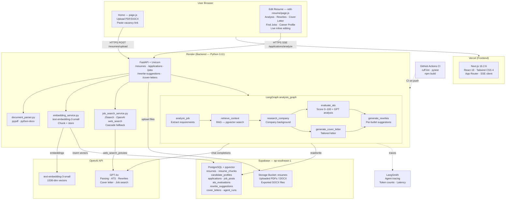

# Reeracify

AI-powered resume optimizer. Upload your resume, get an ATS score, AI rewrite suggestions, a tailored cover letter, and matching job listings — all in one place.

**Live app:** [reeracify.vercel.app](https://reeracify.vercel.app)  
**API:** [reeracify-backend.onrender.com](https://reeracify-backend.onrender.com)  
**API Docs:** [reeracify-backend.onrender.com/docs](https://reeracify-backend.onrender.com/docs)

---

## How It Works

```
You upload a resume PDF/DOCX
        │
        ▼
Backend extracts text (pypdf / python-docx)
        │
        ▼
GPT parses into structured JSON → resume_id returned
  Sections: name, email, phone, summary, skills, education,
            work_experience, projects, leadership, achievements,
            certifications, languages
        │
        ▼
Text chunks embedded (text-embedding-3-small, 1536-dim) → stored in pgvector
        │
        ▼
You land on the 5-tab editor. Click Analyze:
        │
        ├─── POST /applications/{id}/analyze  (SSE streaming)
        │         │
        │         ▼  LangGraph analysis_graph runs sequentially:
        │
        │    [1] analyze_job        Extract structured requirements from job URL
        │         │
        │    [2] retrieve_context   pgvector cosine similarity search over resume chunks
        │         │
        │    [3] research_company   Gather company background (optional MCP / web)
        │         │
        │         ├────────────────────────────────┐  (parallel fan-out)
        │    [4a] evaluate_ats              [4b] generate_cover_letter
        │         └────────────────────────────────┘  (fan-in)
        │         │
        │    [5] generate_rewrites   Per-bullet rewrite suggestions
        │         │
        │         ▼  {"done": true, "result": {...}} SSE event
        │
        ├─ Analysis tab    → ATS score 0-100 + strength/weakness breakdown
        │
        ├─ Rewrites tab    → Approve/Reject bullets → resume preview updates live
        │
        ├─ Cover Letter    → Edit and download as .txt
        │
        ├─ Find Jobs       → JSearch / OpenAI web search for real postings
        │                    → "Evaluate Fit" reruns full pipeline for any job
        │
        └─ Career Profile  → Target roles, core skills, seniority, search queries
        │
        ▼
Download DOCX — approved rewrites applied, all sections included
```

---

## Cloud Architecture



---

## Tech Stack

| Layer | Technology | Version | Purpose |
|-------|-----------|---------|---------|
| **Frontend** | Next.js | 16.2.6 | App router, SSR, SSE streaming client |
| **Frontend** | React | 19.2.4 | UI, inline resume editing |
| **Frontend** | Tailwind CSS | 4.x | Styling |
| **Backend** | FastAPI | 0.115+ | Async REST API, StreamingResponse for SSE |
| **Backend** | Python | 3.11 | Runtime |
| **Backend** | Uvicorn | 0.30+ | ASGI server |
| **AI / LLM** | OpenAI GPT | configured via env | Parsing, scoring, rewrites, cover letters |
| **Embeddings** | text-embedding-3-small | 1536-dim | Chunk vectorization for RAG |
| **Agents** | LangGraph | 0.2+ | Stateful multi-step workflow with fan-out/fan-in |
| **Agents** | LangChain | 0.3+ | LLM wrappers, prompt templates |
| **Observability** | LangSmith | 0.1+ | Agent tracing, token counts, debug |
| **Database** | Supabase Postgres | — | Structured data |
| **Vector Search** | pgvector | 1536-dim cosine | Resume chunk similarity search |
| **File Storage** | Supabase Storage | — | PDF/DOCX uploads, exported files |
| **Job Search** | JSearch (RapidAPI) | — | Real job postings |
| **Job Search** | OpenAI web_search_preview | — | Fallback / KR+MY markets |
| **File Parsing** | pypdf, python-docx | — | Extract text from uploaded files |
| **Hosting** | Vercel | — | Frontend, auto-deploy on push |
| **Hosting** | Render | — | Backend, auto-deploy on push |
| **CI/CD** | GitHub Actions | — | Lint (ruff) + pytest on every push |

---

## LangGraph Analysis Pipeline

The core AI workflow lives in `backend/app/agents/graph.py`. When the frontend calls `POST /applications/{id}/analyze`, LangGraph executes `analysis_graph` and streams Server-Sent Events back.

### Graph Structure

```
START
  │
  ▼
analyze_job ──────────────────── extracts required_skills, preferred_skills,
  │                               responsibilities, keywords, seniority from
  │                               the job description (GPT, JSON mode)
  ▼
retrieve_context ─────────────── pgvector cosine similarity: job description
  │                               as query → top N resume chunks returned
  ▼
research_company ─────────────── gathers company background (optional MCP /
  │                               web scraping; gracefully skipped if unavailable)
  │
  ├──────────────────────────────────────────────────────┐
  ▼                                                      ▼
evaluate_ats                                  generate_cover_letter
  │  deterministic score (0–100)                │  tailored letter from
  │  + GPT qualitative analysis                 │  resume + job + context
  │  → ats_result saved to DB                   │  → cover_letter saved to DB
  └──────────────────────────┬───────────────────┘
                             ▼
                     generate_rewrites
                       │  per-bullet suggestions → rewrite_suggestions table
                       ▼
                      END

SSE events emitted at each node:
  {"step": "[STATUS] Extracting job requirements..."}
  {"step": "[STATUS] Retrieving relevant resume sections..."}
  {"step": "[STATUS] Researching company background..."}
  {"step": "[STATUS] Evaluating ATS score..."}
  {"step": "[STATUS] Writing personalized cover letter..."}
  {"step": "[STATUS] Generating rewrite suggestions..."}
  {"done": true, "result": { ats, suggestions, cover_letter, errors }}
```

### Shared Agent State

All nodes communicate through a single `AgentState` TypedDict that flows through the graph:

```python
class AgentState(TypedDict):
    user_id: str
    resume_id: str
    application_id: str
    resume_json: dict           # parsed resume (all sections)
    candidate_profile: dict     # target roles, skills, seniority
    job_json: dict              # job post + extracted requirements
    retrieved_context: list     # top N pgvector chunks
    company_background: str     # optional company research result
    ats_result: dict            # score, rank, matched/missing skills
    rewrite_suggestions: list   # per-bullet rewrites
    cover_letter: str           # generated cover letter text
    errors: list[str]           # non-fatal errors collected across nodes
```

Each node reads what it needs, writes its result back, and passes the enriched state to the next node.

### Agent Descriptions

| Agent | File | Model | What it does |
|-------|------|-------|-------------|
| `analyze_job` | `job_analyzer_agent.py` | GPT | Extracts `required_skills`, `preferred_skills`, `responsibilities`, `keywords`, `seniority_level`, `job_type` from the raw job description into structured JSON. Always runs first so every downstream node has clean requirements. |
| `retrieve_context` | `rag_retriever_agent.py` | pgvector | Embeds the job description, runs cosine similarity against the user's `resume_chunks` table, returns top N most relevant chunks. These chunks give ATS evaluator and rewrite agent focused context rather than sending the full resume. |
| `research_company` | `company_research_agent.py` | optional | Gathers background on the company (industry, size, culture) via MCP browser tool or web search. Runs as a no-op if tools are unavailable. Result enriches cover letter tone. |
| `evaluate_ats` | `ats_evaluator_agent.py` | GPT | Two-part: (1) deterministic score 0–100 computed from keyword matching with no LLM call; (2) GPT qualitative analysis for strengths, weaknesses, improvement priorities, and evidence. Runs in parallel with cover letter. |
| `generate_cover_letter` | `cover_letter_agent.py` | GPT | Writes a tailored cover letter using resume JSON + job requirements + retrieved context. Runs in parallel with ATS evaluation. |
| `generate_rewrites` | `rewrite_agent.py` | GPT | Generates per-bullet rewrite suggestions (original → suggested + reason). Runs after both parallel branches complete. Saved to `rewrite_suggestions` table with `pending` status. |
| `resume_parser` | `resume_parser_agent.py` | GPT | Called separately on upload (not in `analysis_graph`). Parses raw resume text into structured JSON including: `work_experience`, `projects`, `education`, `leadership`, `achievements`, `certifications`, `languages`. Strict schema enforcement via system prompt. |
| `candidate_profile` | `candidate_profile_agent.py` | GPT | Called separately via `/resumes/{id}/candidate-profile`. Infers `target_roles`, `core_skills`, `domain_interests`, `seniority_level`, `job_search_queries` from the parsed resume. Powers the Career Profile tab and Find Jobs queries. |

---

## ATS Scoring Logic

The score is computed deterministically in `_compute_ats_score()` — no LLM involved. Fast, consistent, explainable.

### With a job posting (0–100)

| Component | Points | Logic |
|-----------|--------|-------|
| Required skills match | 40 | `matched / total × 40` — pure ratio, 0 if none match |
| Preferred skills match | 20 | `matched / total × 20` — pure ratio |
| Responsibilities match | 20 | Phrase-level: a responsibility counts only when ≥50% of its meaningful words (length > 3) appear in the resume. Prevents single common words from scoring. |
| Keyword density | 10 | `matched / total × 10` |
| Resume depth (bullets) | 10 | 1 pt per bullet point, capped at 10 |

`resume_text` for matching includes: skills, work experience bullets/descriptions, project bullets/descriptions/technologies, leadership bullets/descriptions/titles, achievement titles/descriptions, and certification names.

**Rank thresholds:** `score ≥ 80` → Advanced (상) · `score ≥ 55` → Intermediate (중) · `score < 55` → Beginner (하)

### Without a job posting (general evaluation)

Scores resume completeness and depth instead:

| Component | Points |
|-----------|--------|
| Contact info | 8 if name + email present |
| Education | 7 if any education entry exists |
| Skills | 2 pts/skill up to 30 |
| Work experience | 8 pts/role up to 25 |
| Bullet points | 2 pts/bullet up to 20 |
| Projects | 5 pts/project up to 15 |

---

## Resume Parser — Supported Sections

The parser (`resume_parser_agent.py`) extracts every section it finds and enforces strict classification rules so nothing ends up in the wrong bucket:

| Section | Schema fields | Classification rules |
|---------|--------------|---------------------|
| `work_experience` | company, title, location, start_date, end_date, is_current, description, bullets | Internships, freelance, mentoring, datathon/hackathon participation (technical work), volunteer with responsibilities |
| `education` | institution, degree, field_of_study, start_date, end_date, gpa, description, bullets | All formal education |
| `projects` | name, description, technologies, url, start_date, end_date, bullets | Personal/academic projects |
| `leadership` | title, organization, start_date, end_date, description, bullets | Club officers, student ambassadors, committee members, society roles, publication editors |
| `achievements` | title, date, description | Awards, scholarships, competition wins, honours, dean's list, medals |
| `certifications` | name, issuer, date, description | AWS certs, TOPIK, IELTS, professional credentials, training certificates |
| `languages` | language, proficiency | All language entries |
| `skills` | `[]` of strings | Flat list, preserves all categories |

---

## RAG Pipeline

Retrieval-Augmented Generation runs on every resume evaluation.

```
Resume uploaded
      │
      ▼
Split into chunks (LangChain text splitter) → embed each chunk (text-embedding-3-small)
                                              → store in resume_chunks (pgvector)

When Analyze is clicked:
      │
      ▼
[2] retrieve_context node:
    Job requirements → embed → cosine similarity search against resume_chunks
                             → top 5 chunks stored in LangGraph state

      │  (state.retrieved_context available to all downstream nodes)
      ▼

[4a] evaluate_ats      — reads retrieved_context from state for qualitative GPT analysis
[4b] cover_letter      — reads retrieved_context from state for relevant resume passages
[5]  generate_rewrites — reads retrieved_context from state for targeted bullet fixes
```

Why RAG instead of sending the whole resume every time: token efficiency, relevance focus, avoids context window limits on long resumes.

---

## Key Implementation Details

### Streaming SSE (`/applications/{id}/analyze`)

The frontend connects via `fetch()` with a `ReadableStream` reader. The backend returns `StreamingResponse(media_type="text/event-stream")`. Each LangGraph node emits one `{"step": "..."}` event as it starts. Final event: `{"done": true, "result": {...}}`. Error event: `{"error": "..."}`.

This allows the UI to show real-time progress ("Extracting job requirements… Evaluating ATS score…") during the 10–30 second pipeline run.

### Live Rewrite Preview

When the user approves a rewrite suggestion, `approveRewrite()` in the frontend:
1. Calls `PATCH /rewrite-suggestions/{id}` to persist the approval
2. Immediately calls `applyRewriteToResume(rewrite, resumeData)` — a pure function that finds the matching bullet/description in the correct section and replaces `original_text` with `suggested_text`
3. `setResumeData(prev => applyRewriteToResume(rewrite, prev))` — React re-renders the live preview

The resume preview updates instantly without a round-trip.

### DOCX Export with Rewrites

`POST /applications/{id}/export-resume` receives the live `resume_json` from the frontend (matching exactly what's displayed), loads all `approved` rewrites from the DB, and calls `generate_resume_docx(resume_json, approved_rewrites)`. The exporter:
1. Applies rewrites via `_apply_rewrites()` — handles all sections including leadership, achievements, certifications
2. Renders all sections in order with python-docx styling
3. Returns the file as a direct binary response (no Supabase Storage round-trip)

### Job Search — Cascade Provider

`JOB_SEARCH_PROVIDER=cascade` (default): tries JSearch (RapidAPI) first for countries where it has good coverage, falls back to OpenAI `web_search_preview` for KR/MY markets and when `JSEARCH_API_KEY` is not set. `openai_web` skips JSearch entirely.

---

## Feature Walkthrough

### 1. Upload → Parse → Embed
- Accepts PDF or DOCX (max 10 MB)
- Text extraction: `pypdf` for PDF, `python-docx` for DOCX
- GPT parses into structured JSON — all 8 sections extracted, nothing summarized
- Text split into overlapping chunks → embedded → stored in pgvector
- Frontend stores `resume_id`, `user_id`, `parsed_json` in `localStorage`

### 2. Analysis Tab
- Evaluates resume quality (no job) or job fit (with URL)
- Score 0–100 displayed with progress bar
- Rank: `Beginner` / `Intermediate` / `Advanced`
- GPT identifies 3–5 strengths, weaknesses, improvement priorities
- Each suggestion links to a rewrite card in the Rewrites tab

### 3. Rewrites Tab
- GPT-4o rewrites each bullet with added metrics, action verbs, and relevant keywords
- Click a card → that text highlighted in yellow in the resume preview
- **Approve** → preview updates instantly with new text (live state update)
- **Reject** → greyed out
- Approved rewrites are included in DOCX export

### 4. Cover Letter Tab
- Pre-filled from the last `analysis_graph` run on page load
- Editable textarea — make changes before downloading
- Download as `.txt`

### 5. Find Jobs Tab
- 11 countries: 🇺🇸🇸🇬🇬🇧🇨🇦🇩🇪🇦🇺🇳🇱🇯🇵🇰🇷🇲🇾🇮🇳
- Optional city / remote filter
- Queries built from `candidate_profile.target_roles` (e.g. "Machine Learning Engineer Seoul")
- **Evaluate Fit** on any job card → creates new application + runs full pipeline for that job

### 6. Career Profile Tab
- Generates: seniority level, target roles, core skills, domain interests, strongest experiences
- **Search Jobs with this Profile** → switches to Find Jobs tab and fires search

### 7. Download DOCX
- Sends live `resumeData` to backend (matches preview exactly)
- Backend applies approved rewrites + generates styled DOCX
- All sections rendered: Summary, Skills, Education, Experience, Projects, Leadership, Achievements, Certifications, Languages
- Direct browser download, no extra auth needed

---

## API Endpoints

### Resumes
| Method | Path | Description |
|--------|------|-------------|
| `POST` | `/resumes/upload` | Parse PDF/DOCX → embed chunks → return `resume_id` + `parsed_json` |
| `POST` | `/resumes/{id}/candidate-profile` | Generate career profile (target roles, skills, queries) |

### Applications (core evaluation flow)
| Method | Path | Description |
|--------|------|-------------|
| `POST` | `/applications/create` | Link resume + job post → return `application_id` |
| `GET`  | `/applications/{id}` | Fetch application row |
| `POST` | `/applications/{id}/analyze` | **SSE** — full LangGraph pipeline (preferred) |
| `POST` | `/applications/{id}/retrieve-context` | RAG retrieval only |
| `POST` | `/applications/{id}/evaluate` | ATS score only |
| `POST` | `/applications/{id}/rewrite-suggestions` | Generate rewrites only |
| `POST` | `/applications/{id}/cover-letter` | Generate cover letter only |
| `POST` | `/applications/{id}/export-resume` | Apply rewrites → return DOCX binary |

### Jobs
| Method | Path | Description |
|--------|------|-------------|
| `POST` | `/jobs/search-web` | Search real job postings |
| `POST` | `/job-posts/create` | Create job post from URL |

### Other
| Method | Path | Description |
|--------|------|-------------|
| `PATCH` | `/rewrite-suggestions/{id}` | Approve or reject a suggestion |
| `GET`  | `/cover-letters/{id}` | Fetch saved cover letter |
| `GET`  | `/health` | Liveness check |
| `GET`  | `/health/openai` | Test OpenAI API connectivity |

---

## Database Schema (Supabase)

```
users
  └── resumes
  │     ├── raw_text, parsed_json (all sections)
  │     ├── resume_chunks  ← pgvector: text + embedding vector(1536)
  │     └── candidate_profiles
  │
  └── applications  ─── links resume ↔ job_post
        ├── status: created → rag_completed → evaluated → rewrite_pending
        │                   → cover_letter_generated → resume_exported
        ├── retrieved_contexts   (RAG results per application)
        ├── ats_evaluations      (score, rank, matched/missing skills)
        ├── rewrite_suggestions  (original, suggested, reason, status)
        └── cover_letters

job_posts
  ├── company_name, role_title, location, job_url
  ├── job_description (raw text)
  └── extracted_requirements (JSON: required_skills, preferred_skills, …)

agent_runs
  └── logs every agent invocation: input_json, output_json, status, error_message
```

**pgvector detail:** `resume_chunks.embedding` is `vector(1536)`. Similarity search via the `match_resume_chunks(query_embedding, match_count, filter)` RPC with cosine distance.

---

## Setup — Run Locally

### Prerequisites
- Python 3.11+
- Node.js 20+
- Supabase project (free tier works)
- OpenAI API key

### 1. Clone
```bash
git clone https://github.com/juliairsalina/reeracify.git
cd reeracify
```

### 2. Backend
```bash
cd backend

# Install (uv recommended)
pip install uv
uv venv && source .venv/bin/activate

uv pip install -r requirements.txt

# Configure
cp .env.example .env
# Fill in OPENAI_API_KEY, SUPABASE_URL, SUPABASE_SERVICE_ROLE_KEY

# Run
uvicorn app.main:app --reload --port 8000
# Docs: http://localhost:8000/docs
```

### 3. Frontend
```bash
cd frontend
npm install
echo "NEXT_PUBLIC_API_BASE_URL=http://localhost:8000" > .env.local
npm run dev
# App: http://localhost:3000
```

### Environment Variables

**`backend/.env`:**
```bash
# Required
OPENAI_API_KEY=sk-...
SUPABASE_URL=https://xxxx.supabase.co
SUPABASE_SERVICE_ROLE_KEY=eyJ...
SUPABASE_ANON_KEY=eyJ...

# Job search (pick one)
JOB_SEARCH_PROVIDER=cascade    # cascade | jsearch | openai_web | dummy
JSEARCH_API_KEY=                # optional — get at rapidapi.com
JSEARCH_COUNTRY=kr

# Optional observability
LANGCHAIN_TRACING_V2=true
LANGCHAIN_API_KEY=ls-...
LANGCHAIN_PROJECT=reeracify
```

**`frontend/.env.local`:**
```bash
NEXT_PUBLIC_API_BASE_URL=http://localhost:8000
```

---

## Deployment

### Render (Backend)
1. New Web Service → connect repo
2. Build: `pip install -r requirements.txt`
3. Start: `uvicorn app.main:app --host 0.0.0.0 --port $PORT`
4. Set all env vars in Render dashboard
5. Auto-deploys on push to `julia/backend-new`

### Vercel (Frontend)
1. Import repo → Framework: Next.js
2. Add: `NEXT_PUBLIC_API_BASE_URL=https://reeracify-backend.onrender.com`
3. Auto-deploys on push

---

## Job Search Providers

| Provider | Key needed | Notes |
|----------|-----------|-------|
| `cascade` | optional `JSEARCH_API_KEY` | Uses JSearch when key present + country supported; falls back to OpenAI web for KR/MY |
| `jsearch` | `JSEARCH_API_KEY` | Best quality. Free tier: 200 req/month |
| `openai_web` | (uses `OPENAI_API_KEY`) | No extra key. Burns ~$0.01/search in OpenAI tokens |
| `dummy` | none | Returns 3 hardcoded jobs. CI/testing only |

---

## CI/CD

GitHub Actions runs on every push to `main` and `julia/backend-new`:

```
Backend job:
  1. Python 3.11 setup
  2. pip install -r requirements.txt ruff
  3. ruff check app/          ← lint
  4. pytest app/tests/ -v     ← 50+ tests

Frontend job:
  1. Node 20 setup
  2. npm install
  3. npm run build            ← type-check + build
```

Tests cover: ATS scoring logic, DOCX export + rewrite application, API endpoints, RAG chunking + embedding, graph compilation, job discovery, candidate profile generation.

---

## Troubleshooting

| Problem | Fix |
|---------|-----|
| `cleanBullet is not defined` | Already fixed — function is defined inside `ResumeDocument` as a local closure. If it recurs, check Next.js version compatibility. |
| `No module named 'pypdf'` | `uv pip install pypdf pycryptodome` |
| Backend 403/429 on job search | JSearch key missing or quota exhausted → set `JOB_SEARCH_PROVIDER=openai_web` |
| Resume parse returns `{}` | Check `OPENAI_API_KEY` is set and valid |
| Jobs found: 0 | Generate Career Profile first (provides `target_roles`), or try a different country |
| Supabase `Invalid API key` | Check `SUPABASE_URL` and `SUPABASE_SERVICE_ROLE_KEY` in `.env` |
| `pyo3_runtime.PanicException` on PDF | Install `pycryptodome` — C extension conflict with old cryptography package |
| ATS score always 90-100 | Fixed — scoring uses no floors for job-based mode; phrase-level responsibility matching |

---

## File Structure

```
reeracify/
├── backend/
│   ├── app/
│   │   ├── agents/
│   │   │   ├── graph.py                  # LangGraph analysis_graph (DAG definition)
│   │   │   ├── state.py                  # AgentState TypedDict
│   │   │   ├── resume_parser_agent.py    # GPT: raw text → structured JSON
│   │   │   ├── ats_evaluator_agent.py    # Deterministic score + GPT analysis
│   │   │   ├── rewrite_agent.py          # Per-bullet rewrite suggestions
│   │   │   ├── cover_letter_agent.py     # Tailored cover letter generation
│   │   │   ├── candidate_profile_agent.py # Target roles, skills, search queries
│   │   │   ├── job_analyzer_agent.py     # Job requirements extraction
│   │   │   ├── rag_retriever_agent.py    # pgvector similarity search
│   │   │   └── company_research_agent.py # Company background (optional MCP)
│   │   ├── api/
│   │   │   ├── resumes.py                # /resumes/*
│   │   │   ├── applications.py           # /applications/* (includes SSE /analyze)
│   │   │   ├── jobs.py                   # /jobs/*
│   │   │   ├── job_posts.py              # /job-posts/*
│   │   │   ├── rewrites.py               # /rewrite-suggestions/*
│   │   │   └── cover_letters.py          # /cover-letters/*
│   │   ├── services/
│   │   │   ├── openai_client.py          # GPT chat + embedding wrapper
│   │   │   ├── supabase_client.py        # DB client singleton
│   │   │   ├── job_search_service.py     # JSearch / OpenAI web / cascade / dummy
│   │   │   ├── document_parser.py        # PDF/DOCX text extraction
│   │   │   ├── embedding_service.py      # Chunk + embed resume text
│   │   │   ├── vector_store.py           # pgvector insert + cosine search
│   │   │   └── docx_exporter.py          # DOCX generation with rewrite application
│   │   ├── schemas/                      # Pydantic request/response models
│   │   ├── config.py                     # Pydantic Settings (env var loading)
│   │   └── main.py                       # FastAPI app + CORS + router registration
│   ├── requirements.txt
│   └── .env.example
│
├── frontend/
│   ├── src/
│   │   ├── app/
│   │   │   ├── page.js                   # Home: upload + parse
│   │   │   ├── edit-resume/page.js       # 5-tab editor (main file ~2400 lines)
│   │   │   ├── contact/page.js
│   │   │   ├── layout.js
│   │   │   └── globals.css
│   │   └── utils/
│   │       └── cleanBullet.js            # Bullet glyph stripper (imported where needed)
│   ├── package.json
│   └── next.config.js
│
├── .github/workflows/ci.yml              # Backend lint+test, frontend build
├── README.md
├── AGENTS.md                             # LLM agent instructions (Next.js breaking changes)
└── CLAUDE.md
```
